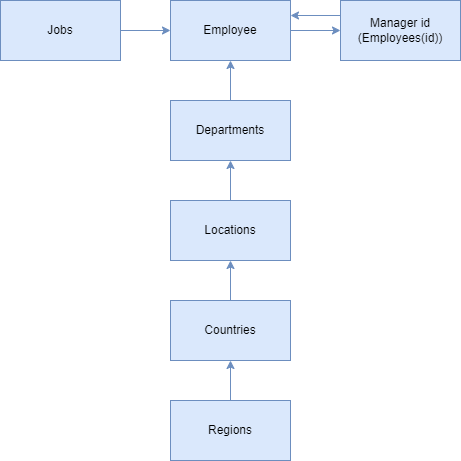
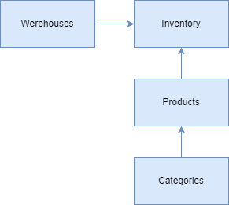

### Project Description

I'm Making basic Employee and Inventory ERP REST Application for creating future test repo with Rest Assured and BDD approach

### To connect to the service:
1. Launch EmployeedemoApplication.class 
2. Connect to the http://localhost:8080/employee-demo if you want to test it using postman

### Swagger documentation for existing API:

http://localhost:8080/employee-demo/swagger-ui/index.html#/

http://localhost:8080/employee-demo/api-docs

### ToDo:
1. Add more API calls for:
   1. Employee:
      1. ~~Jobs~~,
      2. ~~Region~~,
      3. ~~Countries~~,
      4. Locations,
      5. Departments,
      6. Employee
   2. Warehouse:
      1. Warehouses,
      2. Categories,
      3. Products,
      4. Inventory
2. ~~Create DB for basic CRUD Operation~~
3. ~~Create models for each table~~
4. Create separate repo for tests with rest assured, and BDD approach
5. Add liquibase script to reset and setup DB

### DB Workflow for Employee Table

### DB Workflow for Inventory Table

